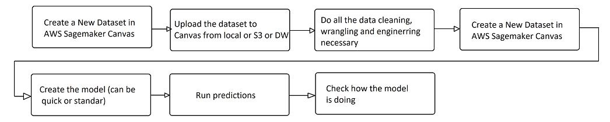

# Sagemaker_datawrangler_model_training_canvas

This project goes thrpugh all the process of Data Wrangling to Model training using Low-Code tool AWS SAGEMAKER CANVAS

First we create the dataset, we can upload it from an S3 buckt or local

We select the Dataset

We process the data using Sagemaker Data Wrangler (LOW-CODE)
We create a model.

Now we are able to predict

The predictions are doing it very well

This is a whole sum up of the processes.

